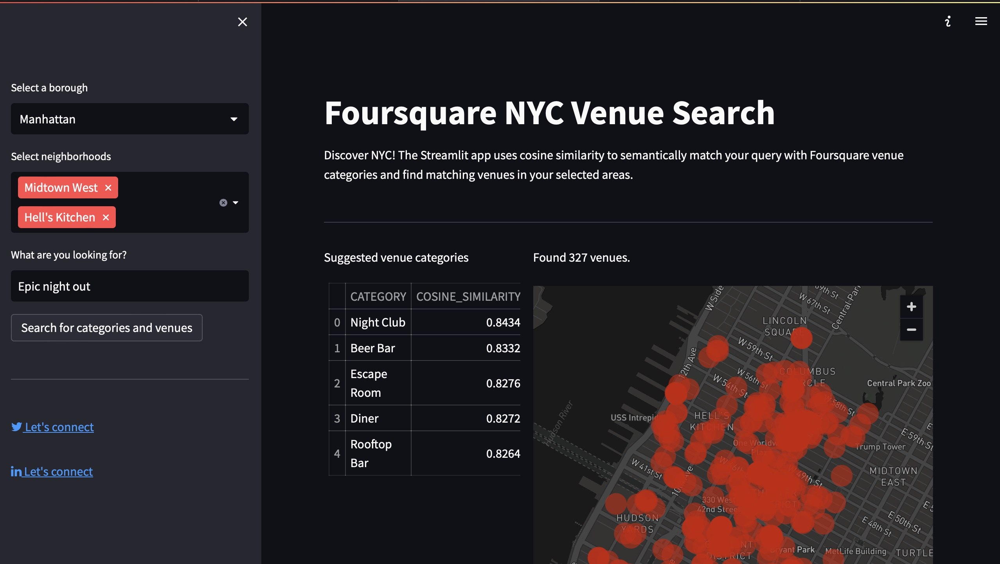

# Foursquare NYC Venue Search
 NYC semantic venue search (Streamlit + Snowflake)



## Description
Discover NYC with this [Streamlit](https://streamlit.io) app! It utilizes cosine similarity to semantically match your search query with Foursquare venue categories, helping you find matching venues in your selected neighborhoods across the city. Powered by Streamlit, [Snowflake](https://www.snowflake.com/en/), and [OpenAI](https://openai.com), this app allows users to explore NYC like never before.


## Features
* Select up to five neighborhoods in a borough to focus your search
* Input a search term (e.g., "Epic night out") to find relevant venue categories
* The app uses cosine similarity to match your query with Foursquare venue categories
* View suggested venues on a map and in a table with venue details


## Technical Implementation
* Streamlit app for the frontend user interface
* [OpenAI API](https://platform.openai.com/docs/guides/embeddings) to generate text embeddings for search queries and for Foursquare venue categories. 
* Snowflake for data storage and retrieval


## Building the App 
Follow these steps to build the app: 
1. Clone the repository.
2. Follow the steps in `/scripts/snowflake_setup.sql` to embed the Foursquare venue categories and set up the database and tables in Snowflake.
3. Create a `.streamlit/secrets.toml` file containing the following: 
```
[snowflake]
user = ""
password = ""
account = ""
warehouse = ""
database = ""
schema = ""

[openai]
api_key = ""
```

## Accessing the App
You can access the app on the Streamlit Cloud community at [nyc-venue-search.streamlit.app](http://nyc-venue-search.streamlit.app). Please note that the hosted version of this app may be taken down at any time, as it was created for the Streamlit [Summit Hackathon](https://forms.streamlit.io/summit-hackathon). To build and run the app yourself, you can clone the repository, set up Snowflake, and follow the steps in the "Building the App" section.


## Feedback
If you have any feedback or questions about this app, please contact me on Twitter at [@dclin](https://twitter.com/dclin).
Thank you for checking out the tool!